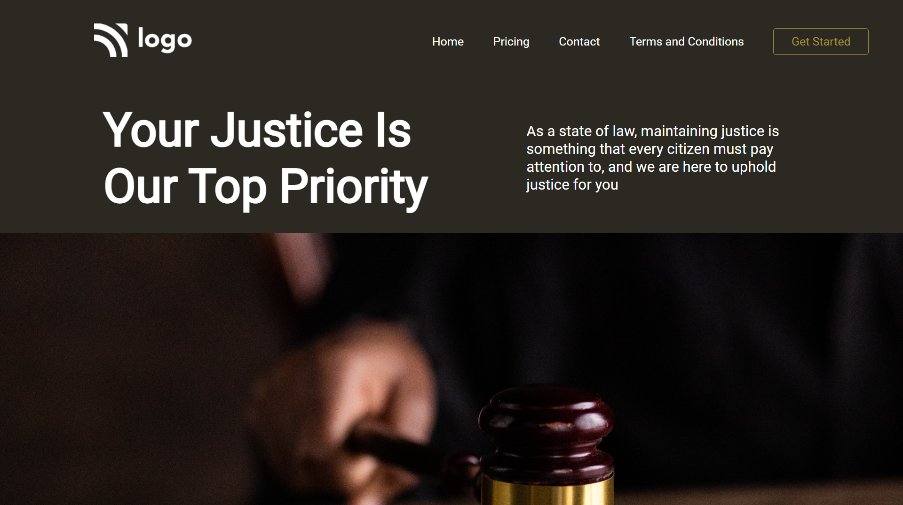

# Law Home Page

Made by **Omprasad Dornala**

## Description

This page focuses on positioning of image using background property and adding style to buttons.

## Built with

- Semantic HTML
- CSS

## Key learnings

- Absolute positioning of background image.
- Adding the style to buttons
- To apply flex.

## Time taken

- This project took me more than 2hrs of time.

## Deployed Version Link

- [Live Demo]()

## Snapshot of Webpage

